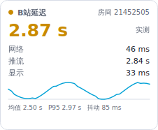

<div align="center">


# 哔哩哔哩延迟监视器 · Bilibili Latency Monitor

**即時顯示 B 站直播「伺服器 → 你的電腦 → 螢幕」的延遲，常駐在狀態列或直播畫面旁。**

免費開源 · 免登入 · 免安裝 exe · 支援 Windows / macOS / Linux · 简体 / 繁體 / English

[功能](#-功能) · [安裝](#-安裝) · [使用](#-使用) · [設定](#️-設定說明) · [常見問題](#-常見問題-faq) · [English](#english)





</div>

---

## ✨ 功能

- **即時延遲監測**：每 2 秒（可調）量一次，總延遲 + 網路 / 推流 / 顯示三段分項。
- **常駐兩種形態，可同時開**
  - **狀態列（系統匣）圖示**：圖示上直接畫出目前的毫秒數，滑鼠移上去看完整分項。
  - **懸浮窗**：永遠置頂、半透明，可**自由拖曳**、**吸附螢幕角落**，或**跟隨 B 站視窗**移動。
- **位置完全自訂**：四個角落 + 水平/垂直偏移、縮放、透明度、三種主題、緊湊模式、滑鼠穿透、鎖定位置。
- **適合長時間掛著**：資料窗口有上限、記憶體不長胖；探測失敗會指數退避；斷網恢復後自動接上；設定原子寫入不怕當機。
- **統計資訊**：均值、P95、抖動、迷你折線圖，可選擇把每一筆樣本寫成 CSV（自動輪替）。
- **多人可用**：不需要帳號或 Cookie，設定存在各自的使用者目錄，同一台電腦不同使用者互不干擾。
- **免登入、無遙測**：只呼叫瀏覽器打開直播間時同樣的公開 API。
- **完整介面**：所有選項都在設定視窗裡，不用手改設定檔；打包好的 exe 雙擊即用。

> 延遲數字的精確定義、量測公式與誤差範圍，請看 **[docs/METHODOLOGY.md](docs/METHODOLOGY.md)**。

<div align="center">

<br><em>狀態列圖示：綠 / 黃 / 紅 依門檻自動變色</em>
</div>

---

## 📦 安裝

### 方式一：下載現成的執行檔（最簡單，Windows 推薦）

1. 打開 [Releases](https://github.com/cxu4425-beep/Bilibili-netspeed-check/releases) 頁面。
2. 下載對應系統的壓縮檔：
   - Windows：`BiliLatencyMonitor-windows-x64.zip`
   - macOS：`BiliLatencyMonitor-macos-arm64.zip`
   - Linux：`BiliLatencyMonitor-linux-x64.tar.gz`
3. 解壓縮後直接執行 `BiliLatencyMonitor`（Windows 是 `BiliLatencyMonitor.exe`）。
   免安裝、不寫登錄檔（除非你自己勾選「開機自動啟動」）。

> Windows SmartScreen 可能提示「未知發行者」——這是沒有付費程式碼簽章憑證的開源程式的正常現象，
> 點「其他資訊 → 仍要執行」即可。不放心的話請用方式二／方式三自行打包。
>
> macOS 首次開啟若提示「無法驗證開發者」，在「系統設定 → 隱私權與安全性」按「仍要打開」，
> 或執行 `xattr -dr com.apple.quarantine BiliLatencyMonitor.app`。

### 方式二：從原始碼執行（跨平台，需要 Python 3.9+）

```bash
git clone https://github.com/cxu4425-beep/Bilibili-netspeed-check.git
cd Bilibili-netspeed-check

python -m venv .venv
# Windows:        .venv\Scripts\activate
# macOS / Linux:  source .venv/bin/activate

pip install -r requirements.txt
python run.py                   # 直接跑，不用安裝
```

或安裝成系統指令：

```bash
pip install -e .
bili-latency                    # 之後在任何目錄都能啟動
```

Linux 若缺少 Qt 依賴，先裝：

```bash
sudo apt-get install -y libegl1 libgl1 libxkbcommon0 libdbus-1-3 libfontconfig1
```

### 方式三：自己打包 exe

```bash
pip install -r requirements-dev.txt
python packaging/build.py       # 產物在 dist/
```

Windows 也可以直接雙擊 `packaging\build_windows.bat`（會自動建立虛擬環境、安裝依賴、打包）。
專案內附 GitHub Actions（`.github/workflows/build.yml`）：推一個 `v*` tag 就會自動幫三個平台打包並上傳到 Release。

---

## 🚀 使用

### 第一次啟動

1. 執行程式後，狀態列（Windows 右下角 / macOS 選單列）會出現圖示，畫面上出現懸浮窗。
2. 在圖示上按右鍵 → **設定…**（懸浮窗上按右鍵也可以）。
3. 在「直播間號或連結」填入你要看的直播間，支援三種寫法：
   - `21452505`
   - `https://live.bilibili.com/21452505`
   - 直接把網址列整段貼上（含 `?spm_id_from=...` 也沒問題）
4. 按「確定」。數字開始跳動就成功了。

留空房間號也能用：此時進入**僅網路模式**，只量到 B 站伺服器的網路延遲。

### 讓它待在你要的位置

在設定的「顯示」分頁選一種**位置模式**：

| 模式 | 行為 | 適合 |
| --- | --- | --- |
| **自由拖動**（預設） | 用滑鼠拖到哪就停在哪，關掉再開也記得 | 想放在直播畫面某個角落 |
| **吸附螢幕角落** | 固定在指定螢幕的某個角落 + 偏移量 | 多螢幕、想固定在副螢幕 |
| **跟隨B站視窗** | 自動貼著標題含「哔哩哔哩」的視窗移動 | 瀏覽器視窗會移動、切換的人 |

> 「跟隨B站視窗」目前只在 **Windows** 上有效（用 `user32` 尋找視窗）。
> macOS / Linux 會自動退回「吸附螢幕角落」。關鍵字可自己改，例如改成 `Chrome` 或直播間標題。

### 常用操作

| 操作 | 效果 |
| --- | --- |
| 左鍵拖曳懸浮窗 | 移動位置（勾了「鎖定位置」就不會被拖動） |
| 懸浮窗上按右鍵 | 打開選單（和狀態列圖示右鍵選單相同） |
| 雙擊懸浮窗 | 切換緊湊模式（只顯示總延遲的大數字） |
| 單擊狀態列圖示 | 顯示 / 隱藏懸浮窗 |
| 選單 → 鼠標穿透 | 讓懸浮窗不擋滑鼠，點擊會穿到下面的視窗 |
| 選單 → 暫停監測 | 暫時停止探測（例如你要跑測速） |
| 選單 → 複製診斷信息 | 複製一份 JSON 診斷資料，回報問題時貼上很有幫助 |

### 命令列參數

```bash
bili-latency --room 21452505              # 啟動時直接指定直播間
bili-latency --lang zh_TW                 # 指定介面語言 (auto / zh_CN / zh_TW / en)
bili-latency --no-overlay                 # 只留狀態列圖示
bili-latency --no-tray                    # 只留懸浮窗
bili-latency --config-dir D:\bili-cfg     # 攜帶式：設定寫到指定資料夾
bili-latency --reset-config               # 用預設值啟動（不刪除原本的設定檔）
bili-latency --probe-once --room 21452505 # 不開視窗，量一次印出 JSON 後結束
```

`--probe-once` 很適合排查問題或寫成腳本定時記錄：

```json
{
  "total_ms": 2534.7,
  "stream_ms": 2534.7,
  "network_ms": 41.2,
  "ok": true,
  "estimated": false,
  "method": "hls-pdt",
  "host": "cn-hbyc-ct-01.bilivideo.com"
}
```

---

## ⚙️ 設定說明

<div align="center"></div>

### 常規

| 項目 | 說明 |
| --- | --- |
| 直播間號或連結 | 要監測的直播間；留空 = 僅網路模式 |
| 探測間隔 | 預設 2000 ms。長時間掛著建議 2000–5000 ms |
| 統計窗口 | 均值 / P95 / 抖動 使用的樣本數（預設 180） |
| 界面語言 | 跟隨系統 / 简体中文 / 繁體中文 / English |
| 開機自動啟動 | Windows 寫 `HKCU\...\Run`；Linux 寫 `~/.config/autostart`；macOS 寫 LaunchAgent |
| 狀態列圖示 | 是否顯示系統匣圖示、是否在圖示上畫出數值 |

### 顯示

位置模式、角落、偏移、螢幕、跟隨關鍵字、不透明度、縮放、主題（深色 / 淺色 / 粉色）、
總在最前、鼠標穿透、鎖定位置、緊湊模式，以及分項 / 折線圖 / 統計行的顯示開關。

### 高級

| 項目 | 說明 |
| --- | --- |
| 請求超時 | 單次 HTTP / TCP 探測的等待上限 |
| 播放地址刷新 | 播放 URL 會過期，預設每 240 秒重取一次 |
| RTT 探測主機 | 沒設定房間時，用來量網路延遲的主機 |
| 優先使用 HLS | 開啟（預設）才能拿到帶伺服器時鐘的「實測」延遲 |
| 播放器緩衝分片數 | 估算播放器要墊多少緩衝，預設 1 個分片 |
| 合成器排隊幀數 | 顯示延遲模型的排隊層數，預設 2 |
| 顯示器輸入延遲補償 | 你的螢幕面板延遲（可查評測），預設 0 |
| 總延遲包含顯示延遲 | 關掉後總延遲只算到「客戶端拿到影格」為止 |
| 綠色 / 黃色門檻 | 顏色變化的門檻，預設 2000 / 5000 ms |
| 記錄到 CSV | 把每一筆樣本寫進 `logs/latency.csv`（自動輪替，保留 3 份） |

### 設定檔位置

| 系統 | 路徑 |
| --- | --- |
| Windows | `%APPDATA%\Bilibili Latency Monitor\config.json` |
| macOS | `~/Library/Application Support/Bilibili Latency Monitor/config.json` |
| Linux | `~/.config/bili-latency-monitor/config.json` |

日誌與 CSV 在同目錄的 `logs/` 底下。選單的「打開配置目錄」會直接幫你開啟。
用 `--config-dir` 可以指定到 USB 隨身碟，做成攜帶式版本。

---

## 👥 多人使用

- **不需要 B 站帳號**，不讀取瀏覽器 Cookie，任何人下載就能用。
- 設定與紀錄都放在**目前使用者**的設定目錄，同一台電腦上不同 Windows 使用者各自獨立。
- 每個使用者同時只會有一份程式在跑（重複啟動會把已在執行的那份叫出來，而不是開第二份），
  不同使用者之間互不影響。
- 介面支援 简体中文 / 繁體中文 / English，預設跟隨系統語言。
- 想在公司或宿舍分享？直接把 Release 的壓縮檔丟給對方就好，沒有安裝程序、沒有註冊表殘留。

---

## ❓ 常見問題 FAQ

**Q：一直顯示「主播未开播」？**
A：該直播間目前沒有開播（輪播錄影也算沒開播）。換一個正在直播的房間號即可。

**Q：顯示「探测失败」怎麼辦？**
A：依序檢查：網路是否正常、公司/校園網是否擋了 B 站 CDN、有沒有設定系統代理
（本程式會沿用系統代理設定）。選單 →「複製診斷信息」可以看到最後一次的錯誤內容。

**Q：數字旁邊寫「估算」和「實測」差在哪？**
A：「實測」代表拿到了播放清單裡的伺服器時鐘（`hls-pdt`），最準；
「估算」代表只能從分片長度或首個關鍵影格推算。詳見
[docs/METHODOLOGY.md](docs/METHODOLOGY.md)。

**Q：為什麼監視器顯示 2.5 秒，但我覺得延遲有 8 秒？**
A：監視器量的是「現在開始播會落後多少」，你的播放器可能已經累積了很多緩衝。
重新整理直播頁面通常就會回到監視器顯示的水準——這正是這個工具最實用的地方。

**Q：找不到狀態列圖示？**
A：Windows 會把新圖示藏在「顯示隱藏的圖示」箭頭裡，拖出來釘住即可。
Linux 某些桌面環境需要安裝 AppIndicator 擴充套件；沒有系統匣時程式會只顯示懸浮窗。

**Q：懸浮窗在全螢幕遊戲/播放器上看不到？**
A：獨佔全螢幕模式下，任何置頂視窗都會被蓋掉，請把播放器改成「視窗化全螢幕 / 無邊框」。
Linux 的 Wayland 對「總在最前」支援有限，必要時改用 X11 工作階段。

**Q：懸浮窗擋到我點按鈕了。**
A：開啟選單裡的「鼠標穿透」，滑鼠就會直接點到下面的視窗；要再調整位置時把它關掉即可。

**Q：會不會很吃資源 / 會不會被風控？**
A：預設每 2 秒一次 TCP 交握 + 一份幾 KB 的播放清單，遠低於一個網頁播放器的流量；
探測失敗會自動退避。只用公開 API、不登入、不模擬觀看行為。

**Q：可以同時監測多個直播間嗎？**
A：一個使用者同時跑一份程式、監測一個房間。要監測多個房間，可以用不同的
`--config-dir` 搭配 `--probe-once` 寫成腳本記錄。

---

## 🛠 開發

```bash
pip install -r requirements-dev.txt
python -m pytest tests -q          # 單元測試，全部離線執行，不需要網路
python docs/make_screenshots.py    # 重新產生 README 的截圖
python assets/make_icon.py         # 重新產生圖示
```

專案結構：

```
src/bili_latency/
├── cli.py            命令列進入點（run.py 只是免安裝的啟動器）
├── app.py            主程式：串起懸浮窗、狀態列、設定、監測執行緒
├── monitor.py        監測迴圈（獨立執行緒，含退避與時鐘校正）
├── config.py         每位使用者的設定檔（原子寫入、損毀自動隔離）
├── models.py         樣本與滾動統計
├── i18n.py           简体 / 繁體 / English 字串表
├── recording.py      CSV 紀錄與輪替
├── autostart.py      三個平台的開機自動啟動
├── probes/
│   ├── network.py    TCP RTT、TTFB、時鐘偏移
│   ├── stream.py     playurl API、m3u8 解析、FLV tag 解析
│   └── display.py    影格週期與顯示延遲估算
└── ui/
    ├── overlay.py    懸浮窗（繪製、拖曳、跟隨視窗）
    ├── tray.py       狀態列圖示
    ├── settings.py   設定視窗
    ├── anchor.py     位置計算與 Windows 視窗搜尋
    ├── icons.py      程式內畫出來的圖示
    └── theme.py      配色與數字格式化
```

歡迎 issue 與 PR。送 PR 前請先跑過 `python -m pytest tests -q`。

---

## 📄 授權與聲明

MIT License，詳見 [LICENSE](LICENSE)。

本專案為**非官方**的第三方工具，與上海寬娛數碼科技有限公司（bilibili）無任何隸屬關係。
只使用公開的網頁 API 讀取直播間狀態與播放地址，不需要登入、不會蒐集或上傳任何個人資料。
「哔哩哔哩」「bilibili」為其各自權利人的商標。

---

# English

**Bilibili Latency Monitor** shows, in real time, how far behind a Bilibili live stream
is — from the server, through your machine, to your screen — in a always-on-top overlay
and/or a status-bar (tray) icon that draws the number right on itself.

### Highlights

- Total latency plus a **network / stream / display** breakdown, refreshed every 2 s (configurable).
- Overlay you can **drag freely**, **pin to a screen corner**, or **attach to the Bilibili window** (Windows).
- Tray icon with the live value, colour coded green / amber / red.
- Built for long sessions: bounded memory, exponential backoff, atomic config writes, auto recovery.
- Stats (avg / p95 / jitter), a sparkline, and optional CSV logging with rotation.
- **No account, no cookies, no telemetry** — only the public endpoints a browser already calls.
- 简体中文 / 繁體中文 / English, per-user settings, single instance per user.

### Install

Download a build from [Releases](https://github.com/cxu4425-beep/Bilibili-netspeed-check/releases)
(`.exe` for Windows, `.app` for macOS, a binary for Linux) — no installation needed.

From source (Python 3.9+):

```bash
git clone https://github.com/cxu4425-beep/Bilibili-netspeed-check.git
cd Bilibili-netspeed-check
pip install -r requirements.txt
python run.py --room 21452505   # or: pip install -e . && bili-latency
```

Build your own executable: `pip install -r requirements-dev.txt && python packaging/build.py`.

### Usage

Right-click the tray icon (or the overlay) → **Settings**, paste a room id or a
`https://live.bilibili.com/...` URL, and press OK. Leave the room empty for
network-only mode. Handy flags:

```bash
bili-latency --lang en --room 21452505     # language + room
bili-latency --no-tray                     # overlay only
bili-latency --config-dir /media/usb/cfg   # portable settings
bili-latency --probe-once --room 21452505  # one JSON measurement, no window
```

### How the number is computed

`total = stream + display`, where **stream** is measured from the HLS playlist's
`EXT-X-PROGRAM-DATE-TIME` server clock when available (shown as *measured*) and
estimated from the playlist window or the first FLV key frame otherwise (*estimated*).
**display** is a model of the client-to-photons delay you can calibrate or exclude.
The **network** RTT is reported for context and never added twice.
Full details, formulas and error bars: **[docs/METHODOLOGY.md](docs/METHODOLOGY.md)**.

### Licence

MIT. Unofficial third-party tool, not affiliated with bilibili.
