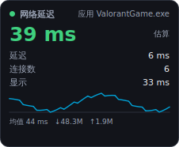
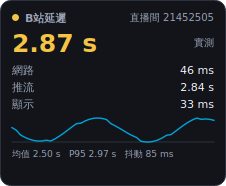
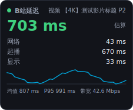
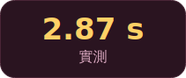
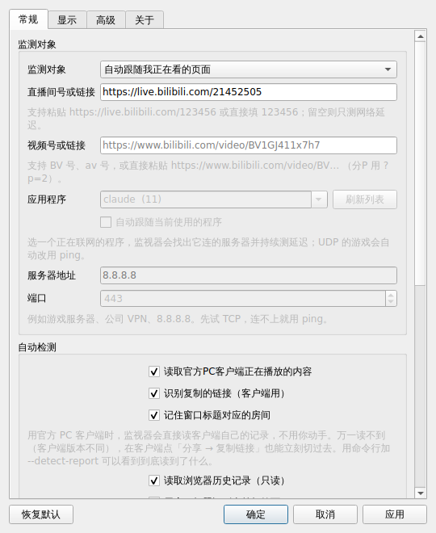

<div align="center">


# 延遲監視器 · Latency Monitor

**任何程式的即時延遲都能看：遊戲、通話、瀏覽器、下載——常駐在狀態列或畫面角落。**
**對 B 站另外做了深度支援：自動跟著你正在看的直播間／影片，量到「伺服器 → 電腦 → 螢幕」。**

免費開源 · 免登入 · 免安裝 exe · 支援 Windows / macOS / Linux · 简体 / 繁體 / English

[功能](#-功能) · [安裝](#-安裝) · [使用](#-使用) · [自動偵測](#-自動跟隨我正在看的頁面) · [設定](#️-設定說明) · [常見問題](#-常見問題-faq) · [English](#english)






<em>左起：任意應用（延遲＋連線數＋上下行）、B 站直播、B 站影片（起播＋頻寬）、緊湊模式</em>

</div>

---

## ✨ 功能

### 任何程式都能測（不限 B 站）

- **選一個程式**（遊戲、Discord、瀏覽器、下載器…），監視器會找出**它實際連的伺服器**並持續測延遲；
  UDP 的遊戲連不上 TCP 時自動改用 ping。順便顯示它開了幾條連線。
- **自動跟隨目前使用的程式**：切到哪個視窗就量哪個程式，不用每次設定。
- **自訂伺服器位址**：直接填 `8.8.8.8`、遊戲伺服器、公司 VPN，先試 TCP、不通就 ping。
- **全機上傳／下載速度**：每一筆樣本都附帶，一眼看出「是不是有別的東西在吃頻寬」。
- **卡頓與延遲突增偵測**：探測失敗或延遲跳到平常的兩倍以上就記一次事件，
  可選擇彈出提示（有冷卻時間，不會一直吵）。

### B 站深度支援

- **自動跟隨你在看的頁面**：不用每次手動貼房間號，換直播間、換影片、換分頁都會自己切過去
  （見[自動偵測](#-自動跟隨我正在看的頁面)），也可以隨時關掉改成手動指定。
- **網頁版和官方 PC 客戶端都支援**：客戶端也是全自動的（直接讀它自己的瀏覽紀錄），
  萬一版本不同讀不到，複製一次分享連結也能立刻切過去。
- **直播與一般影片都能測**：直播量的是離直播邊緣有多遠；一般影片量的是
  **起播延遲**與**頻寬餘量**（線路撐不撐得住這個畫質、會不會轉圈）。
- **即時延遲監測**：每 2 秒（可調）量一次，總延遲 + 網路 / 推流 / 顯示三段分項。
- **CDN 線路比較**：B 站同一個直播間會發好幾個節點，監視器會定期把每條線都測一遍，
  在診斷資訊裡告訴你目前這條多快、最快的是哪一條。
- **直播間詳情**：人氣、分區、開播時長、畫質名稱、編碼、格式，全都看得到。
- **常駐兩種形態，可同時開**
  - **狀態列（系統匣）圖示**：圖示上直接畫出目前的毫秒數，滑鼠移上去看完整分項。
  - **懸浮窗**：永遠置頂、半透明，可**自由拖曳**、**吸附螢幕角落**，或**跟隨 B 站視窗**移動。
- **位置完全自訂**：四個角落 + 水平/垂直偏移、縮放、透明度、三種主題、緊湊模式、滑鼠穿透、鎖定位置。
- **適合長時間掛著**：資料窗口有上限、記憶體不長胖；探測失敗會指數退避；斷網恢復後自動接上；設定原子寫入不怕當機。
- **統計資訊**：均值、P95、抖動、迷你折線圖，可選擇把每一筆樣本寫成 CSV（自動輪替）。
- **多人可用**：不需要帳號或 Cookie，設定存在各自的使用者目錄，同一台電腦不同使用者互不干擾。
- **免登入、無遙測**：只呼叫瀏覽器打開直播間時同樣的公開 API。
- **完整介面**：所有選項都在設定視窗裡，不用手改設定檔；打包好的 exe 雙擊即用。

> 延遲數字的精確定義、量測公式與誤差範圍，請看 **[docs/METHODOLOGY.md](docs/METHODOLOGY.md)**。

<div align="center">

<br><em>狀態列圖示：綠 / 黃 / 紅 依門檻自動變色</em>
</div>

---

## 📦 安裝

### 方式一：下載現成的執行檔（最簡單，Windows 推薦）

1. 打開 [Releases](https://github.com/cxu4425-beep/Bilibili-netspeed-check/releases) 頁面。
2. 下載對應系統的壓縮檔：
   - Windows：`BiliLatencyMonitor-windows-x64.zip`
   - macOS：`BiliLatencyMonitor-macos-arm64.zip`
   - Linux：`BiliLatencyMonitor-linux-x64.tar.gz`
3. 解壓縮後直接執行 `BiliLatencyMonitor`（Windows 是 `BiliLatencyMonitor.exe`）。
   免安裝、不寫登錄檔（除非你自己勾選「開機自動啟動」）。

> Windows SmartScreen 可能提示「未知發行者」——這是沒有付費程式碼簽章憑證的開源程式的正常現象，
> 點「其他資訊 → 仍要執行」即可。不放心的話請用方式二／方式三自行打包。
>
> macOS 首次開啟若提示「無法驗證開發者」，在「系統設定 → 隱私權與安全性」按「仍要打開」，
> 或執行 `xattr -dr com.apple.quarantine BiliLatencyMonitor.app`。

### 方式二：從原始碼執行（跨平台，需要 Python 3.9+）

```bash
git clone https://github.com/cxu4425-beep/Bilibili-netspeed-check.git
cd Bilibili-netspeed-check

python -m venv .venv
# Windows:        .venv\Scripts\activate
# macOS / Linux:  source .venv/bin/activate

pip install -r requirements.txt
python run.py                   # 直接跑，不用安裝
```

或安裝成系統指令：

```bash
pip install -e .
bili-latency                    # 之後在任何目錄都能啟動
```

Linux 若缺少 Qt 依賴，先裝：

```bash
sudo apt-get install -y libegl1 libgl1 libxkbcommon0 libdbus-1-3 libfontconfig1
```

### 方式三：自己打包 exe

```bash
pip install -r requirements-dev.txt
python packaging/build.py       # 產物在 dist/
```

Windows 也可以直接雙擊 `packaging\build_windows.bat`（會自動建立虛擬環境、安裝依賴、打包）。
專案內附 GitHub Actions（`.github/workflows/build.yml`）：推一個 `v*` tag 就會自動幫三個平台打包並上傳到 Release。

---

## 🚀 使用

### 第一次啟動

1. 執行程式後，狀態列（Windows 右下角 / macOS 選單列）會出現圖示，畫面上出現懸浮窗。
2. **直接用瀏覽器打開任何 B 站直播間或影片**，監視器會自己認出來並開始量
   （預設就是「自動跟隨我正在看的頁面」）。
3. 想手動指定的話：在圖示或懸浮窗上按右鍵 → **設定…** → 把「監測對象」改成
   「手動指定直播間」或「手動指定視頻」，再填內容。

**監測對象**五種模式（設定 → 常規 → 監測對象）：

| 模式 | 說明 |
| --- | --- |
| **自動跟隨我正在看的頁面**（預設）| 自動偵測你在看哪個 B 站直播間／影片，換頁就跟著換 |
| **手動指定直播間** | 只量你填的那個直播間，不受瀏覽器影響 |
| **手動指定視頻** | 只量你填的那支影片（可指定分 P）|
| **任意應用程序** | 選一個程式（遊戲、通話、瀏覽器…），量它**實際連的伺服器** |
| **自定義服務器地址** | 直接填 IP／網域＋連接埠，例如遊戲伺服器、`8.8.8.8` |

填寫格式都很寬鬆：

- 直播間：`21452505`、`https://live.bilibili.com/21452505`，或整段網址貼上。
- 影片：`BV1GJ411x7h7`、`av170001`、`https://www.bilibili.com/video/BV1GJ411x7h7?p=2`（分 P 用 `?p=`）。
- 應用程式：從下拉選單挑（會列出正在連網的程式和它的連線數），或直接打 `game.exe`；
  也可以勾「自動跟隨當前使用的程序」，切到哪個視窗就量哪個。

全部留空、又關掉自動偵測時，進入**僅網路模式**，只量到 B 站伺服器的網路延遲。

### 量任何程式（遊戲／通話／下載…）

1. 設定 → 常規 → 監測對象 → **任意應用程序**
2. 從下拉選單選你的程式（例如 `ValorantGame.exe`、`Discord.exe`、`chrome.exe`），
   按「刷新列表」可以重新掃描；程式還沒開的話直接把名字打進去也行。
3. 確定。懸浮窗會變成：**延遲 / 連接數 / 顯示**，統計列顯示 **↓下載 ↑上傳**。

它是怎麼量的：從系統的連線表找出**這個程式現在連著哪些伺服器**，挑連線數最多的那個公網位址，
每輪對它計時一次 TCP 交握。很多遊戲走 UDP，TCP 連不上時會自動改用系統 `ping`（不需要管理員權限）。

| 你會看到 | 意思 |
| --- | --- |
| 延遲 | 到該程式伺服器的往返時間（TCP 或 ping）|
| 連接數 | 這個程式目前開著幾條連線 |
| ↓ / ↑ | 整台電腦的下載／上傳速度，用來判斷「是不是有別的東西在吃頻寬」|

> 讀的是自己電腦上、自己程式的連線表（Windows/Linux 直接可讀；macOS 對其他程式的連線可能需要權限，
> 讀不到時會顯示「該應用當前沒有網絡連接」）。不注入、不抓封包、不看內容。

### 直播和影片量的東西不一樣

| | 直播 | 一般影片 |
| --- | --- | --- |
| 中間那一列 | **推流**：離直播邊緣有多遠 | **起播**：現在開播要等多久才有畫面 |
| 統計列 | 均值 / P95 / 抖動 | 均值 / P95 / **帶寬**（實測下載速度）|
| 典型數值 | 2–6 秒 | 0.3–1.5 秒 |
| 怎麼看 | 數字越小越接近「即時」 | 帶寬遠大於畫質碼率＝不會卡；接近或更低＝會轉圈 |

錄播沒有「直播邊緣」，所以延遲改用「起播延遲 + 頻寬餘量」表示——這才是看影片時真正有感的東西。
公式與誤差都寫在 [docs/METHODOLOGY.md](docs/METHODOLOGY.md)。

### 讓它待在你要的位置

在設定的「顯示」分頁選一種**位置模式**：

| 模式 | 行為 | 適合 |
| --- | --- | --- |
| **自由拖動**（預設） | 用滑鼠拖到哪就停在哪，關掉再開也記得 | 想放在直播畫面某個角落 |
| **吸附螢幕角落** | 固定在指定螢幕的某個角落 + 偏移量 | 多螢幕、想固定在副螢幕 |
| **跟隨B站視窗** | 自動貼著標題含「哔哩哔哩」的視窗移動 | 瀏覽器視窗會移動、切換的人 |

> 「跟隨B站視窗」目前只在 **Windows** 上有效（用 `user32` 尋找視窗）。
> macOS / Linux 會自動退回「吸附螢幕角落」。關鍵字可自己改，例如改成 `Chrome` 或直播間標題。

### 常用操作

| 操作 | 效果 |
| --- | --- |
| 左鍵拖曳懸浮窗 | 移動位置（勾了「鎖定位置」就不會被拖動） |
| 懸浮窗上按右鍵 | 打開選單（和狀態列圖示右鍵選單相同） |
| 雙擊懸浮窗 | 切換緊湊模式（只顯示總延遲的大數字） |
| 單擊狀態列圖示 | 顯示 / 隱藏懸浮窗 |
| 選單 → 鼠標穿透 | 讓懸浮窗不擋滑鼠，點擊會穿到下面的視窗 |
| 選單 → 暫停監測 | 暫時停止探測（例如你要跑測速） |
| 選單 → 複製診斷信息 | 複製一份 JSON 診斷資料，回報問題時貼上很有幫助 |

---

## 🔎 自動跟隨我正在看的頁面

監視器用幾個**各自獨立、都可以單獨關掉**的來源判斷你在看什麼，優先順序由高到低：

| 來源 | 怎麼運作 | 適用 | 預設 |
| --- | --- | --- | --- |
| **油猴腳本** | 頁面自己把網址回報到 `http://127.0.0.1:23124` | 瀏覽器（最準，換分頁立刻反映）| 關（需裝腳本）|
| **視窗標題** | 記住「這個視窗標題 = 這個直播間」，之後看到同樣標題就自動認出 | 客戶端／瀏覽器（Windows）| 開 |
| **歷史紀錄 + 視窗標題** | 取最近造訪的 B 站網址，再用開著的視窗標題比對出「現在這個分頁」 | 瀏覽器（Windows）| 開 |
| **官方客戶端紀錄** | 直接讀客戶端自己的資料夾，看它最近在播什麼 | **官方 PC 客戶端（全自動）** | 開 |
| **複製連結** | 你按「分享 → 複製連結」，監視器認出剪貼簿裡的 B 站網址 | 客戶端備援、手機分享的連結、任何 App | 開 |
| **歷史紀錄** | 取時間窗口內最新一筆 B 站網址 | 瀏覽器 | 開 |

> 前兩者是**現在畫面上開著什麼**的證據，所以排在前面；
> 後三者比誰的時間比較新，新的贏。

### 用官方 PC 客戶端的話（不用瀏覽器也可以）

**測量本身完全不受影響**——延遲是直接問 B 站公開 API 的，跟你用網頁版、官方客戶端還是別的播放器無關。
自動偵測也有專門的路：官方客戶端是 Chromium 核心的程式，**它自己會在使用者資料夾裡留下瀏覽紀錄**，
監視器就直接讀那份（唯讀、只挑 B 站網址），所以**你什麼都不用做**——打開直播間就開始量了。

它會自動找這些位置：`%APPDATA%` 和 `%LOCALAPPDATA%` 底下的
`bilibili` / `BiliBili` / `哔哩哔哩` 等資料夾，以及 Microsoft Store 版的
`Packages\*Bilibili*`；找到 Chromium 格式的 `History` 就直接讀，沒有的話改掃客戶端自己的
`.log` 檔（只抓 `roomid` / `room_id` / `BV` 號，不留其他內容）。

**先跑一次這個確認你的客戶端讀不讀得到：**

```bash
bili-latency --detect-report          # 打包版：BiliLatencyMonitor.exe --detect-report
```

它會列出找到的客戶端資料夾、讀到的房間號、視窗標題等等。如果 `client.folders` 是空的，
代表你的客戶端裝在別的位置——用 `--client-dir "路徑"` 指定（可重複），
順便把路徑回報給我，我加進預設清單。

**萬一真的讀不到（客戶端版本不同），還有兩層備援：**

1. 在客戶端點 **分享 → 複製連結**（`b23.tv` 短連結會自動還原），監視器立刻切過去，
   同時把**當下客戶端視窗的標題**和這個房間配成一對記起來——之後再打開同一個直播間，
   光靠視窗標題就自動認出，不用再複製。
2. 把「監測對象」改成手動指定，貼一次房間號就固定量它。

補充：

- 客戶端視窗標題若只有「哔哩哔哩」這種看不出房間的字樣，就學不到標題對應；
  這時複製過的目標會一直保持到你複製下一個連結為止。
- 剪貼簿只處理**含 B 站網址**的文字，其他內容一律忽略，不記錄、不上傳。
- 學到的「標題 ↔ 房間」對應存在設定目錄的 `titles.json`（最多 200 筆），可以直接刪掉。
- 讀客戶端資料、讀剪貼簿、記標題這三項都能在「設定 → 常規 → 自動檢測」個別關掉。
- 懸浮窗的「跟隨B站視窗」也適用於客戶端：把關鍵字設成客戶端視窗標題裡有的字（預設「哔哩哔哩」）即可。

### 關於讀取瀏覽器歷史紀錄（用瀏覽器的人請先看這段）

這是**用瀏覽器**時，不裝任何外掛也能知道你在看哪個頁面的方法，做法刻意收得很窄：

- 歷史紀錄檔會先**複製**成暫存檔，再以**唯讀**方式開啟，瀏覽器開著也能讀，且**絕不寫回原檔**；
- SQL 只撈網址含 `bilibili.com` 的列，**其他網站的紀錄不會被讀出來**；
- 只看設定的時間窗口內（預設 30 分鐘）的紀錄；
- 結果只有房間號或 BV 號，**只留在記憶體裡，不上傳、不寫檔、不需要登入**；
- 支援 Chrome / Edge / Brave / Vivaldi / Chromium / Firefox 的各個設定檔。

不想用就在「設定 → 常規 → 自動檢測」把「讀取瀏覽器歷史記錄」取消勾選；
整個自動偵測也可以在托盤選單一鍵關閉（**自動跟隨觀看頁面**）。

### 想要最準：安裝油猴腳本（選用）

1. 瀏覽器安裝 [Tampermonkey](https://www.tampermonkey.net/)（或 Violentmonkey）。
2. 安裝本專案的
   [`extras/bilibili-latency-bridge.user.js`](extras/bilibili-latency-bridge.user.js)
   （在 GitHub 上點檔案 → Raw，油猴會自動跳出安裝視窗）。
3. 監視器裡：**設定 → 常規 → 自動檢測 → 勾選「接收油猴腳本上報」**，端口保持一致（預設 23124）。

腳本只做一件事：把目前頁面的網址 POST 到 `127.0.0.1`。不讀 Cookie、不讀頁面內容、
不連任何外部伺服器；監視器的接收埠只綁定本機、只接受 `*.bilibili.com` 來源的請求。

### 命令列參數

```bash
bili-latency --room 21452505              # 啟動時直接指定直播間（並關閉自動偵測）
bili-latency --video BV1GJ411x7h7         # 指定影片；也可貼整段網址（?p=2 指定分P）
bili-latency --detect                     # 強制開啟自動跟隨
bili-latency --no-detect                  # 強制關閉自動跟隨
bili-latency --lang zh_TW                 # 指定介面語言 (auto / zh_CN / zh_TW / en)
bili-latency --no-overlay                 # 只留狀態列圖示
bili-latency --no-tray                    # 只留懸浮窗
bili-latency --config-dir D:\bili-cfg     # 攜帶式：設定寫到指定資料夾
bili-latency --reset-config               # 用預設值啟動（不刪除原本的設定檔）
bili-latency --probe-once --room 21452505 # 不開視窗，量一次印出 JSON 後結束
bili-latency --probe-once --detect        # 量「我現在正在看的那個頁面」一次
bili-latency --detect-report              # 列出各偵測來源在你機器上讀到什麼（排查用）
bili-latency --client-dir "D:\bili"       # 客戶端裝在別處時，指定它的資料夾（可重複）
bili-latency --app ValorantGame.exe       # 量某個程式的延遲
bili-latency --app-foreground             # 量目前最前面那個程式
bili-latency --ping 8.8.8.8               # 量某個位址（用 --ping-port 指定連接埠）
bili-latency --list-apps                  # 列出正在連網的程式（挑名字用）
```

`--probe-once` 很適合排查問題或寫成腳本定時記錄：

```json
{
  "total_ms": 2534.7,
  "stream_ms": 2534.7,
  "network_ms": 41.2,
  "ok": true,
  "estimated": false,
  "kind": "live",
  "method": "hls-pdt",
  "host": "cn-hbyc-ct-01.bilivideo.com",
  "target": { "kind": "live", "id": "21452505", "page": 1, "source": "history+title" }
}
```

影片模式下還會多出 `throughput_mbps`（實測下載速度）與 `required_mbps`（該畫質需要的碼率）。

---

## ⚙️ 設定說明

<div align="center"></div>

### 常規

| 項目 | 說明 |
| --- | --- |
| 監測對象 | 自動跟隨 / 直播間 / 視頻 / 任意應用程序 / 自定義服務器地址 |
| 應用程序 | 「任意應用程序」模式要量哪個程式，可勾自動跟隨前景程式 |
| 服務器地址 / 端口 | 「自定義服務器地址」模式要量的目標 |
| 顯示全機上傳／下載速度 | 每筆樣本附帶網速（可關）|
| 卡頓／延遲突增時彈出提示 | 有冷卻時間，不會一直吵（可關）|
| 直播間號或連結 | 要監測的直播間；自動模式下當作找不到頁面時的備援 |
| 視頻號或連結 | 要監測的影片，支援 BV / av / 網址（`?p=` 指定分 P）|
| 自動檢測：讀取官方PC客戶端正在播放的內容 | 直接讀客戶端自己的紀錄，全自動（可關）|
| 自動檢測：識別復制的鏈接 | 客戶端備援：複製分享連結就自動切換（可關）|
| 自動檢測：記住窗口標題對應的房間 | 學會「這個視窗標題 = 這個直播間」，之後自動認出（可關）|
| 自動檢測：讀取瀏覽器歷史記錄 | 本機唯讀、只看 bilibili.com 網址（可關）|
| 自動檢測：用窗口標題識別當前標籤頁 | 讓它跟著你切分頁走（Windows）|
| 自動檢測：也跟隨普通視頻 | 關掉的話只跟隨直播間，看影片時維持原本目標 |
| 自動檢測：接收油猴腳本上報 | 最準的來源，需安裝 [`extras/`](extras/) 裡的腳本 |
| 自動檢測：時間窗口 / 檢測間隔 | 歷史紀錄要看多久以內、多久重新判斷一次 |
| 探測間隔 | 預設 2000 ms。長時間掛著建議 2000–5000 ms |
| 統計窗口 | 均值 / P95 / 抖動 使用的樣本數（預設 180） |
| 界面語言 | 跟隨系統 / 简体中文 / 繁體中文 / English |
| 開機自動啟動 | Windows 寫 `HKCU\...\Run`；Linux 寫 `~/.config/autostart`；macOS 寫 LaunchAgent |
| 狀態列圖示 | 是否顯示系統匣圖示、是否在圖示上畫出數值 |

### 顯示

位置模式、角落、偏移、螢幕、跟隨關鍵字、不透明度、縮放、主題（深色 / 淺色 / 粉色）、
總在最前、鼠標穿透、鎖定位置、緊湊模式，以及分項 / 折線圖 / 統計行的顯示開關。

### 高級

| 項目 | 說明 |
| --- | --- |
| 請求超時 | 單次 HTTP / TCP 探測的等待上限 |
| 播放地址刷新 | 播放 URL 會過期，預設每 240 秒重取一次 |
| RTT 探測主機 | 沒設定房間時，用來量網路延遲的主機 |
| 優先使用 HLS | 開啟（預設）才能拿到帶伺服器時鐘的「實測」延遲 |
| 播放器緩衝分片數 | 估算播放器要墊多少緩衝，預設 1 個分片 |
| 合成器排隊幀數 | 顯示延遲模型的排隊層數，預設 2 |
| 顯示器輸入延遲補償 | 你的螢幕面板延遲（可查評測），預設 0 |
| 總延遲包含顯示延遲 | 關掉後總延遲只算到「客戶端拿到影格」為止 |
| 綠色 / 黃色門檻 | 顏色變化的門檻，預設 2000 / 5000 ms |
| 記錄到 CSV | 把每一筆樣本寫進 `logs/latency.csv`（自動輪替，保留 3 份） |

### 設定檔位置

| 系統 | 路徑 |
| --- | --- |
| Windows | `%APPDATA%\Bilibili Latency Monitor\config.json` |
| macOS | `~/Library/Application Support/Bilibili Latency Monitor/config.json` |
| Linux | `~/.config/bili-latency-monitor/config.json` |

日誌與 CSV 在同目錄的 `logs/` 底下。選單的「打開配置目錄」會直接幫你開啟。
用 `--config-dir` 可以指定到 USB 隨身碟，做成攜帶式版本。

---

## 👥 多人使用

- **不需要 B 站帳號**，不讀取瀏覽器 Cookie，任何人下載就能用。
- 設定與紀錄都放在**目前使用者**的設定目錄，同一台電腦上不同 Windows 使用者各自獨立。
- 每個使用者同時只會有一份程式在跑（重複啟動會把已在執行的那份叫出來，而不是開第二份），
  不同使用者之間互不影響。
- 介面支援 简体中文 / 繁體中文 / English，預設跟隨系統語言。
- 想在公司或宿舍分享？直接把 Release 的壓縮檔丟給對方就好，沒有安裝程序、沒有註冊表殘留。

---

## ❓ 常見問題 FAQ

**Q：我用的是官方 Windows 客戶端，不用網頁版，可以用嗎？要手動複製連結嗎？**
A：可以用，而且**正常情況下不用手動做任何事**。客戶端是 Chromium 核心，會在自己的
資料夾裡留下瀏覽紀錄，監視器直接讀那份就知道你在看哪個直播間。
先跑 `bili-latency --detect-report` 確認讀不讀得到；讀不到再用「分享 → 複製連結」當備援，
或直接手動指定房間號。詳見[上面這一節](#用官方-pc-客戶端的話不用瀏覽器也可以)。

**Q：自動偵測沒反應／認錯頁面？**
A：依序檢查：
1. 托盤選單的「自動跟隨觀看頁面」有沒有勾；
2. 用**客戶端**的話，有沒有複製過一次分享連結（見上一題）；
3. 用**瀏覽器**的話：設定裡「讀取瀏覽器歷史記錄」是否被關掉、是不是無痕模式
   （無痕不寫歷史紀錄）、瀏覽器是否在支援清單內
   （Chrome / Edge / Brave / Vivaldi / Chromium / Firefox）。
最保險的做法是裝上油猴腳本（瀏覽器）或直接改成「手動指定」。

**Q：讀我的瀏覽器歷史紀錄？我不放心。**
A：可以理解，所以它是可以關的：設定 → 常規 → 自動檢測 → 取消「讀取瀏覽器歷史記錄」。
程式只會複製歷史檔後**唯讀**開啟、只撈網址含 `bilibili.com` 的列、只留房間號／BV 號在記憶體，
不寫回、不上傳、不需要登入。相關程式碼在
[`src/bili_latency/detect/history.py`](src/bili_latency/detect/history.py)，歡迎自己看過再決定。

**Q：一般影片的「延遲」是什麼意思？**
A：錄播沒有直播邊緣，所以量的是**起播延遲**（現在開播要等多久才有畫面）加上顯示延遲，
另外用實測下載速度和該畫質碼率算出**頻寬餘量**，直接告訴你會不會卡。

**Q：一直顯示「主播未开播」？**
A：該直播間目前沒有開播（輪播錄影也算沒開播）。換一個正在直播的房間號即可。

**Q：顯示「探测失败」怎麼辦？**
A：依序檢查：網路是否正常、公司/校園網是否擋了 B 站 CDN、有沒有設定系統代理
（本程式會沿用系統代理設定）。選單 →「複製診斷信息」可以看到最後一次的錯誤內容。

**Q：數字旁邊寫「估算」和「實測」差在哪？**
A：「實測」代表拿到了播放清單裡的伺服器時鐘（`hls-pdt`），最準；
「估算」代表只能從分片長度或首個關鍵影格推算。詳見
[docs/METHODOLOGY.md](docs/METHODOLOGY.md)。

**Q：為什麼監視器顯示 2.5 秒，但我覺得延遲有 8 秒？**
A：監視器量的是「現在開始播會落後多少」，你的播放器可能已經累積了很多緩衝。
重新整理直播頁面通常就會回到監視器顯示的水準——這正是這個工具最實用的地方。

**Q：找不到狀態列圖示？**
A：Windows 會把新圖示藏在「顯示隱藏的圖示」箭頭裡，拖出來釘住即可。
Linux 某些桌面環境需要安裝 AppIndicator 擴充套件；沒有系統匣時程式會只顯示懸浮窗。

**Q：懸浮窗在全螢幕遊戲/播放器上看不到？**
A：獨佔全螢幕模式下，任何置頂視窗都會被蓋掉，請把播放器改成「視窗化全螢幕 / 無邊框」。
Linux 的 Wayland 對「總在最前」支援有限，必要時改用 X11 工作階段。

**Q：懸浮窗擋到我點按鈕了。**
A：開啟選單裡的「鼠標穿透」，滑鼠就會直接點到下面的視窗；要再調整位置時把它關掉即可。

**Q：會不會很吃資源 / 會不會被風控？**
A：預設每 2 秒一次 TCP 交握 + 一份幾 KB 的播放清單，遠低於一個網頁播放器的流量；
探測失敗會自動退避。只用公開 API、不登入、不模擬觀看行為。

**Q：可以同時監測多個直播間嗎？**
A：一個使用者同時跑一份程式、監測一個對象。要同時記錄多個房間／影片，可以用不同的
`--config-dir` 搭配 `--probe-once` 寫成腳本定時執行。

---

## 🛠 開發

```bash
pip install -r requirements-dev.txt
python -m pytest tests -q          # 單元測試，全部離線執行，不需要網路
python docs/make_screenshots.py    # 重新產生 README 的截圖
python assets/make_icon.py         # 重新產生圖示
```

專案結構：

```
src/bili_latency/
├── cli.py            命令列進入點（run.py 只是免安裝的啟動器）
├── app.py            主程式：串起懸浮窗、狀態列、設定、監測執行緒
├── monitor.py        監測迴圈（獨立執行緒，含退避與時鐘校正）
├── config.py         每位使用者的設定檔（原子寫入、損毀自動隔離）
├── models.py         樣本與滾動統計
├── i18n.py           简体 / 繁體 / English 字串表
├── recording.py      CSV 紀錄與輪替
├── autostart.py      三個平台的開機自動啟動
├── targets.py        決定「這一輪要量什麼」（GUI 與命令列共用）
├── events.py         卡頓／延遲突增事件與通知冷卻
├── probes/
│   ├── network.py    TCP RTT、TTFB、ICMP ping、時鐘偏移
│   ├── appnet.py     任意程式：連線表 → 伺服器 → 往返時間
│   ├── netspeed.py   全機上傳／下載速度
│   ├── stream.py     直播 playurl API、m3u8 解析、FLV tag 解析
│   ├── video.py      影片 view/playurl API、Range 測速與起播延遲
│   └── display.py    影格週期與顯示延遲估算
├── detect/           自動判斷你在看哪個頁面
│   ├── urls.py       B站網址 → 監測對象
│   ├── client.py     官方 PC 客戶端的資料夾（History / log，唯讀）
│   ├── history.py    瀏覽器歷史紀錄（複製後唯讀，只篩 bilibili.com）
│   ├── clipboard.py  剪貼簿裡的分享連結、b23.tv 短連結還原
│   ├── titles.py     視窗標題比對與「標題 ↔ 房間」記憶
│   ├── bridge.py     127.0.0.1 上的油猴腳本接收埠
│   └── manager.py    來源優先順序、節流與 --detect-report
└── ui/
    ├── overlay.py    懸浮窗（繪製、拖曳、跟隨視窗）
    ├── tray.py       狀態列圖示
    ├── settings.py   設定視窗
    ├── anchor.py     位置計算與 Windows 視窗搜尋
    ├── icons.py      程式內畫出來的圖示
    └── theme.py      配色與數字格式化

extras/
└── bilibili-latency-bridge.user.js   選用的油猴腳本（最準的自動偵測來源）
```

歡迎 issue 與 PR。送 PR 前請先跑過 `python -m pytest tests -q`。

---

## 📄 授權與聲明

MIT License，詳見 [LICENSE](LICENSE)。

本專案為**非官方**的第三方工具，與上海寬娛數碼科技有限公司（bilibili）無任何隸屬關係。
只使用公開的網頁 API 讀取直播間狀態與播放地址，不需要登入、不會蒐集或上傳任何個人資料。
「哔哩哔哩」「bilibili」為其各自權利人的商標。

---

# English

**Latency Monitor** shows, in real time, the latency of **any application** — a game, a
voice call, a browser, a download — in an always-on-top overlay and/or a status-bar
(tray) icon that draws the number right on itself. Bilibili gets extra depth on top:
it follows whatever you are watching (live rooms and ordinary videos alike) and
measures server → client → screen.

### Highlights

**Any application**

- Pick a program and the monitor finds **the servers it is actually connected to**, then
  times them every round — falling back to `ping` for UDP games. It also shows how many
  sockets that program holds open.
- **Follow the foreground app**: whatever window you switch to is what gets measured.
- **A server address you type**: a game server, a VPN gateway, `8.8.8.8`.
- **Machine upload / download speed** on every sample, so you can see when something else
  is eating the line.
- **Stall and spike detection**: a failed probe, or latency jumping past twice its recent
  normal, is recorded as an event and can raise one (rate-limited) notification.

**Bilibili**

- **Follows what you watch**: no pasting room ids — it detects the live room or video
  you have open and switches with you (see [Auto-detection](#auto-detection)).
- **Live rooms and videos**: live shows the distance from the live edge; a VOD shows
  **start-up delay** and **bandwidth headroom** (can this connection sustain that quality?).
- Total latency plus a **network / stream / display** breakdown, refreshed every 2 s (configurable).
- Overlay you can **drag freely**, **pin to a screen corner**, or **attach to the Bilibili window** (Windows).
- Tray icon with the live value, colour coded green / amber / red.
- Built for long sessions: bounded memory, exponential backoff, atomic config writes, auto recovery.
- Stats (avg / p95 / jitter or speed), a sparkline, and optional CSV logging with rotation.
- **No account, no cookies, no telemetry** — only the public endpoints a browser already calls.
- **CDN line comparison**: the same room is served from several edges; the monitor times
  them all periodically and the diagnostics show how the current one compares to the best.
- **Room details**: popularity, category, uptime, quality name, codec and container.
- 简体中文 / 繁體中文 / English, per-user settings, single instance per user.

### Auto-detection

Independent, individually switchable local sources, highest priority first:

| Source | How | Works with | Default |
| --- | --- | --- | --- |
| **Userscript** | the page posts its URL to `http://127.0.0.1:23124` | browser (best, instant on tab changes) | off (install the script) |
| **Window title** | learns "this window title is that room", then recognises it | client / browser (Windows) | on |
| **History + window titles** | newest visited Bilibili URL, matched against open window titles | browser (Windows) | on |
| **Client records** | reads the desktop client's own data folder | **official desktop client (hands-free)** | on |
| **Copied link** | spots a Bilibili URL you copied to the clipboard | client fallback, shared links, any app | on |
| **History** | newest visited Bilibili URL in the time window | browser | on |

**Using the official desktop client?** Measuring works exactly the same — the numbers come
from the public API, not from your player — and detection needs nothing from you either:
the client is a Chromium-based app that keeps its own browsing records, and the monitor
reads those (read-only, Bilibili URLs only), falling back to the ids in the client's logs.
Run `bili-latency --detect-report` to see exactly what was found on your machine; if the
client lives somewhere unusual, point at it with `--client-dir "PATH"`. Should a client
build store things differently, **share → copy link** still switches the target instantly
and teaches the monitor that window's title for next time.

Reading the browser history is deliberately narrow: the file is **copied** and opened
**read-only** (so a running browser is untouched and nothing is written back), only rows
whose URL contains `bilibili.com` are read, and the result — a room id or a BV id — stays
in memory. The clipboard source only ever acts on text containing a Bilibili URL and stores
nothing else. Turn any of them off in Settings → General → Auto-detection, or switch the
whole thing off from the tray menu. For the most accurate browser option, install
[`extras/bilibili-latency-bridge.user.js`](extras/bilibili-latency-bridge.user.js) in
Tampermonkey and tick "Accept userscript reports".

### Install

Download a build from [Releases](https://github.com/cxu4425-beep/Bilibili-netspeed-check/releases)
(`.exe` for Windows, `.app` for macOS, a binary for Linux) — no installation needed.

From source (Python 3.9+):

```bash
git clone https://github.com/cxu4425-beep/Bilibili-netspeed-check.git
cd Bilibili-netspeed-check
pip install -r requirements.txt
python run.py --room 21452505   # or: pip install -e . && bili-latency
```

Build your own executable: `pip install -r requirements-dev.txt && python packaging/build.py`.

### Usage

Just open a Bilibili live room or video in your browser — the monitor picks it up on
its own. To pin it to one thing instead, right-click the tray icon (or the overlay) →
**Settings** → set "What to monitor" to a live room or a video and paste an id or URL.
With nothing selected and detection off it runs in network-only mode. Handy flags:

```bash
bili-latency --lang en --room 21452505     # language + room (detection off)
bili-latency --video BV1GJ411x7h7          # a video; URLs with ?p=2 work too
bili-latency --no-detect                   # never auto-detect
bili-latency --no-tray                     # overlay only
bili-latency --config-dir /media/usb/cfg   # portable settings
bili-latency --probe-once --detect         # one JSON measurement of what you are watching
bili-latency --app ValorantGame.exe        # measure any application
bili-latency --app-foreground              # measure whatever app is in front
bili-latency --ping 8.8.8.8 --ping-port 53 # measure a server address
bili-latency --list-apps                   # which programs are on the network right now
```

### How the number is computed

For a **live room**, `total = stream + display`, where **stream** is measured from the
HLS playlist's `EXT-X-PROGRAM-DATE-TIME` server clock when available (shown as
*measured*) and estimated from the playlist window or the first FLV key frame otherwise
(*estimated*). For a **video**, the middle term is the start-up delay: a real 512 KB
ranged download gives a measured TTFB and throughput, and the figure shown is
`TTFB + bitrate ÷ throughput`, with the measured speed in the stats row.
**display** is a model of the client-to-photons delay you can calibrate or exclude.
The **network** RTT is reported for context and never added twice.
Full details, formulas and error bars: **[docs/METHODOLOGY.md](docs/METHODOLOGY.md)**.

### Licence

MIT. Unofficial third-party tool, not affiliated with bilibili.
